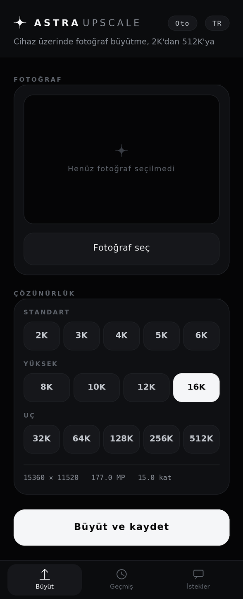
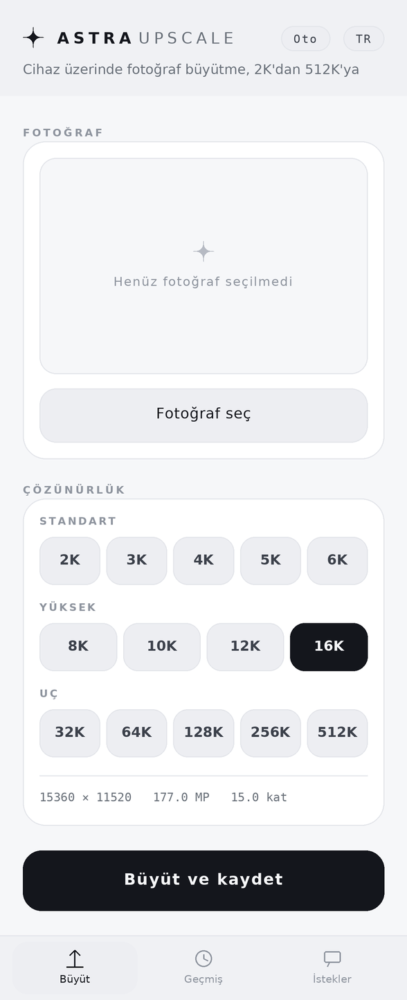

# AstraUpscale

**[English](README.en.md) · Türkçe**

Fotoğrafları cihaz üzerinde **2K'dan 512K'ya** kadar büyüten Android uygulaması.
Real-ESRGAN, SwinIR ve Real-CUGAN modelleri APK'nın içinde taşınır; işlem
tamamen telefonda yapılır ve hiçbir görüntü dışarı çıkmaz.

 

| | |
|---|---|
| Çözünürlük | 2K'dan 512K'ya 14 ön ayar, üç kademede |
| Modeller | Real-ESRGAN (Hızlı / x4plus / Anime 6B), SwinIR-S, SwinIR-M, Real-CUGAN 2×/3×/4×, klasik Lanczos |
| Geçiş | Model tek ya da çift geçiş çalıştırılabilir |
| Gürültü temizleme | 64K ve üzerinde otomatik: kaynak, büyütmeden önce temizlenir |
| Zorlama seviyesi | Sakin / Dengeli / Tam güç |
| Diller | Türkçe ve İngilizce; başlıktaki düğmeyle değiştirilir |
| Tema | Açık ve koyu; sistem ayarını izler, elle de sabitlenebilir |
| Sayfalar | Büyüt · Geçmiş · İstekler (alt gezinme çubuğu) |
| Çıkış | JPEG (kalite ayarlanabilir) veya kayıpsız PNG |
| Kayıt yeri | Galeri › Pictures › AstraUpscale |

## Kurulum

`release/AstraUpscale.apk` dosyasını telefona kopyalayıp aç. Android
"bilinmeyen kaynaklardan yükleme" izni ister.

- Android 7.0 (API 24) ve üzeri
- **arm64-v8a**; 85 MB, dokuz model içeride

## Çözünürlük kademeleri

Hat satır satır aktığı için bellek kullanımı çıkış boyutundan neredeyse
bağımsızdır; sınırları **dosya biçimi, depolama ve süre** koyar.

| Kademe | Ön ayarlar |
|---|---|
| Standart | 2K, 3K, 4K, 5K, 6K |
| Yüksek | 8K, 10K, 12K, 16K |
| Uç | 32K, 64K, 128K, 256K, 512K |

| Ön ayar | Boyut | Piksel | JPEG | Tahmini PNG | Masaüstünde süre |
|---|---|---|---|---|---|
| 32K | 30720×23040 | 0,71 GP | evet | 0,8 GB | 44 sn |
| **64K** | 61440×46080 | 2,83 GP | evet | 3,4 GB | **138 sn** (ölçüldü) |
| 128K | 122880×92160 | 11,3 GP | **hayır** | 13,6 GB | ~10 dk |
| 256K | 245760×184320 | 45,3 GP | **hayır** | 54 GB | ~40 dk |
| 512K | 491520×368640 | 181 GP | **hayır** | 217 GB | ~2,5 saat |

JPEG başlığındaki boyut alanları 16 bittir, yani en fazla 65535 piksel:
**64K'ya kadar JPEG yazılabilir, 128K ve üzeri yalnızca PNG**. Uygulama bu
durumda biçimi kendisi PNG'ye çevirir ve nedenini yazar.

256K ve 512K gerçekten üretilebilir; asıl engel depolamadır. Başlamadan önce
tahmini dosya boyutu ile boş alan karşılaştırılır, yetmiyorsa işlem başlamaz.

## Kullanıcı istekleri

İkinci sayfa geri bildirim içindir: hata bildirimi, öneri ya da genel yorum.
Mesaj bir Discord kanalına ulaşır. İnternet yoksa mesaj diske yazılır ve
bağlantı gelince gönderilir; gönderim başarısız olursa **10 saniyede bir**
yeniden denenir. Uygulama kapalıyken bile Android'in iş planlayıcısı ağ
geldiğinde kuyruğu boşaltır, kuyruk diskte durduğu için cihaz yeniden başlasa
da kayıtlar kaybolmaz.

Mesajla birlikte gönderilenler: uygulama sürümü, dil, Android sürümü, cihaz
modeli, işlemci ve bellek. **Fotoğraflar asla gönderilmez.**

Kuyruk `tools/desktop/QueueTest.java` ile masaüstünde sınandı; 11 denetimin
tamamı geçti: Türkçe metin ve emoji kayıpsız gidip geliyor, bozuk bir satır
kuyruğun tamamını bozmuyor, gönderilen kayıtlar doğru siliniyor ve 500 kayıtlık
üst sınır en yenileri koruyor.

## Arayüz

Tek renkli bir tasarım; vurgu rengi yoktur. Kural şudur: **seçili öge içerik
rengine boyanır, yazısı zemin rengine döner.** Bu kural iki temada da
kendiliğinden tersine döner — koyu temada beyaz zeminli siyah yazı, açık temada
siyah zeminli beyaz yazı. Ayrımlar 1 piksellik saç çizgileriyle, derinlik ise
birbirinden bir tık ayrılan yüzeylerle kurulur.

Renkler anlamsal belirteçlerle tanımlıdır; `values` açık, `values-night` koyu
temayı taşır. Uygulamada tek bir renk sabiti yoktur.

| Belirteç | Açık | Koyu | Kullanım |
|---|---|---|---|
| `bg` | `#F6F7F9` | `#050506` | sayfa zemini |
| `surface_low` | `#F0F1F4` | `#0B0C0E` | başlık ve alt gezinme çubuğu |
| `surface` | `#FFFFFF` | `#0F1013` | kart |
| `surface_high` | `#EDEEF2` | `#16171B` | çip, ikincil düğme |
| `hairline` | `#E3E5EA` | `#1D1F23` | ayrım çizgisi |
| `content` | `#14161C` | `#F5F6F8` | birincil yazı, seçili zemin |
| `content_dim` / `content_faint` / `content_ghost` | `#697079` / `#8E949E` / `#B6BAC3` | `#8B9098` / `#5F646C` / `#3A3E45` | azalan önem |

Üç sayfa alt gezinme çubuğuyla dolaşılır: **Büyüt**, **Geçmiş** (kaydedilen
fotoğraflar) ve **İstekler**. İlk açılışta kısa bir tanıtım ekranı çıkar.

İşaret dört kollu, kolları içbükey kesilen bir yıldızdır; uygulama simgesinde,
başlıkta, boş önizlemede ve sonuç kartında aynı vektör kullanılır.

`docs/arayuz-tr.png` cihaz ekran görüntüsü **değildir**: düzen dosyasındaki
aynı renk, ölçü ve punto değerlerinden üretilmiş bir çizimdir.

## Nasıl çalışıyor

```
kaynak ──► [1] gürültü temizleme (64K ve üzeri)
              │
              ▼
           [2] sinir ağı modeli (ncnn, 2×/3×/4×, isteğe bağlı iki geçiş)
                 döşemeli, komşu piksellerden bağlam alarak → dikişsiz
              │
              ▼
           [3] Lanczos-3 yeniden örnekleme (doğrusal ışıkta)
              │
              ▼
           [4] ölçeğe göre keskinleştirme + akış halinde JPEG/PNG kodlama
```

Çıkış satır satır üretilip doğrudan diske akıtılır. 32K (708 megapiksel) çıktı
62 MB yığınla, 64K (2,83 gigapiksel) çıktı 111 MB yığınla üretildi.

Ayrıntılar — model dönüşümleri, SE blokları, ölçümler — için
[English README](README.en.md) dosyasına bakın; teknik bölümler orada da aynıdır.

## Derleme

```bash
export ANDROID_SDK_ROOT=/opt/android-sdk
bash tools/build-apk.sh          # -> build/AstraUpscale.apk
```

Gerekenler: JDK 17+, `platforms/android-34`, `build-tools/35.0.0`.

Model ve mimari seçilerek daha küçük paket üretilebilir; uygulama
paketlenmemiş modelleri listede göstermez:

```bash
MODELS="realesr-animevideov3-x4 realcugan-up2x-conservative" ABIS="arm64-v8a" \
APK_NAME="AstraUpscale-lite" bash tools/build-apk.sh
```

## Sınırlar ve bilinen noktalar

- Uygulama gerçek bir telefonda çalıştırılarak test **edilmedi** (derleme
  ortamında emülatör için KVM yok). Motor, modeller, gürültü temizleme, aşırı
  genişlikte PNG yazımı ve Discord gönderimi masaüstünde doğrulandı.
- **Discord webhook adresleri APK'nın içindedir ve çıkarılabilir.** Bu
  adresler parola gibi korunamaz; kötüye kullanım olursa Discord'dan webhook'u
  silip yenisini üretmek gerekir.
- BSRGAN varsayılan pakette yok: eklendiğinde APK, GitHub'ın 100 MB dosya
  sınırını aşıyordu. Dosyaları ve dönüşüm betiği depoda.
- 256K/512K bugünün telefonlarında depolama nedeniyle pratikte kullanılamaz.
- Paket arm64-v8a içindir; armeabi-v7a derlenebilir ama ağır modeller o
  cihazlarda pratik değil.
