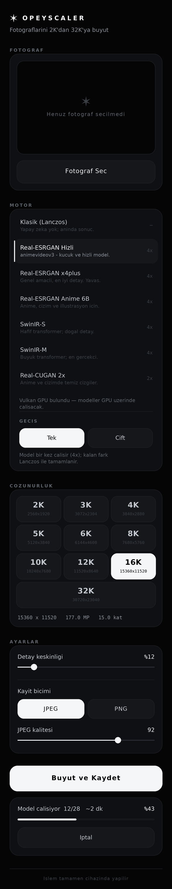
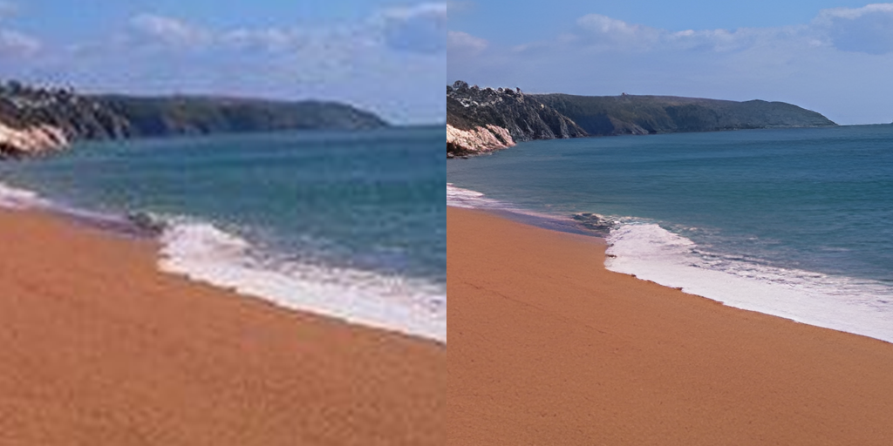

# OpeyScaler

Fotograflari cihaz uzerinde **2K'dan 32K'ya** kadar buyuten Android uygulamasi.
Real-ESRGAN, SwinIR ve Real-CUGAN modelleri APK'nin icinde tasinir; islem
tamamen telefonda yapilir, internet gerekmez ve hicbir goruntu disari cikmaz.





*Sol: klasik Lanczos buyutme. Sag: Real-ESRGAN. Ayni 256x256 kaynaktan 4x.*

## Ne yapiyor

| | |
|---|---|
| Cozunurluk | 2K, 3K, 4K, 5K, 6K, 8K, 10K, 12K, 16K, **32K** (uzun kenara gore, oran korunur) |
| Modeller | Real-ESRGAN (Hizli / x4plus / Anime 6B), SwinIR-S, SwinIR-M, Real-CUGAN 2x/3x/4x, klasik Lanczos |
| Asama secimi | Model tek gecis ya da iki gecis (orn. 4x -> 16x) calistirilabilir |
| Hizlandirma | Vulkan GPU varsa GPU, yoksa cok cekirdekli CPU |
| Cikis | JPEG (kalite ayarlanabilir) veya kayipsiz PNG |
| Kayit yeri | Galeri > Pictures > OpeyScaler |
| Calisma bicimi | On plan servisi: uygulamadan cikilsa da islem surer, iptal edilebilir |

## Modeller

| Model | Olcek | Uygun oldugu sey | Goreli hiz |
|---|---|---|---|
| Real-ESRGAN Hizli (animevideov3) | 4x | Genel, hizli sonuc | 1x (en hizli) |
| Real-ESRGAN x4plus | 4x | Genel fotograf, en iyi detay | 60x yavas |
| Real-ESRGAN Anime 6B | 4x | Anime, cizim, illustrasyon | 16x yavas |
| SwinIR-S | 4x | Hafif transformer, dogal detay | 12x yavas |
| SwinIR-M | 4x | En gercekci sonuc | 150x yavas |
| Real-CUGAN 2x (+ gurultu temizleme) | 2x | Anime, cizim | 8x yavas |
| Real-CUGAN 3x | 3x | Anime, cizim | 18x yavas |
| Real-CUGAN 4x | 4x | Anime, cizim | 24x yavas |
| Klasik (Lanczos) | serbest | Aninda sonuc, her boyut | aninda |

Goreli hiz kaynak piksel basinadir; uygulama secilen modelle fotograf buyuk
geldiginde uyarir ve calisirken kalan sureyi tahmin eder.

## Arayuz

Tek renkli, siyah agirlikli bir tasarim. Vurgu rengi yok: secili oge beyaza
doner, yazisi siyaha gecer. Ayrimlar 1 px sac cizgileriyle, derinlik ise
birbirinden bir tik acilan siyah katmanlarla kurulur.

| Katman | Deger | Kullanim |
|---|---|---|
| `ink` | `#050506` | sayfa zemini |
| `ink_raised` | `#0B0C0E` | basili durum |
| `ink_card` | `#0F1013` | kart |
| `ink_chip` | `#16171B` | cip, ikincil dugme |
| `hairline` | `#1D1F23` | ayrim cizgisi |
| `paper` | `#F5F6F8` | birincil yazi, secili zemin |
| `paper_dim` / `paper_faint` / `paper_ghost` | `#8B9098` / `#5F646C` / `#3A3E45` | azalan onem |

Isaret alti kollu bir yildizdir (✶); hem uygulama simgesinde hem baslikta
hem de bos onizleme ve sonuc kartinda ayni vektor kullanilir. Bolum
basliklari seyrek harfli kucuk buyuk harflerle yazilir, sayisal degerler
(boyut, MP, yuzde, kalite) tek aralikli yazi tipiyle hizalanir. Cozunurluk
izgarasinda son secenek (32K) satirin tamamini kaplar.

Yandaki gorsel, cihaz ekran goruntusu degildir: duzen dosyasindaki ayni
renk, olcu ve punto degerlerinden uretilmis bir onizlemedir.

## Nasil calisiyor

Hat uc asamadan olusur ve **satir satir akar**; cikis goruntusu hicbir zaman
tumuyle bellege alinmaz. 32K (30720 x 23040 = 708 megapiksel) bir cikis bile
62 MB yiginla uretildi.

```
kaynak ──► [1] sinir agi modeli (ncnn, 2x/3x/4x, istege bagli iki gecis)
                 dosemeli, komsu piksellerden baglam alarak → dikissiz
              │
              ▼
           [2] Lanczos-3 yeniden ornekleme (dogrusal isikta)
                 modelin sabit orani ile secilen hedef arasindaki farki kapatir
              │
              ▼
           [3] olcege gore keskinlestirme + akis halinde JPEG/PNG kodlama
```

**1. Sinir agi katmani** (`native/sr_engine.cpp`) ncnn uzerinde calisir. Goruntu
dosemelere bolunur; her dosemenin cevresine gercek goruntuden baglam pikselleri
eklenir (yalnizca kenarlarda kenar tekrari kullanilir), model calistirilir ve
sonuc kirpilarak yerine yazilir. Kirpma payi olculen cikis boyutundan
turetildigi icin Real-ESRGAN (ic kirpma yok), Real-CUGAN (prepadding kadar ic
kirpma) ve SwinIR (sabit girdi boyutu) ayni kodla dogru calisir.

*Real-CUGAN'in SE bloklari* tum goruntu uzerinden kuresel ortalama gerektirir.
Motor bunu ust kaynakla ayni sekilde cozer: dort hazirlik gecisinde her
dosemenin `gap` degeri toplanip ortalanir, ardindan asil gecise sabit deger
olarak beslenir. Boylece dosemeli isleme ile tek parca isleme ayni sonucu verir
(olculen fark 63 dB PSNR).

*Iki gecis* secildiginde birinci gecisin ciktisi bellege sigmayacagi icin ham
RGB olarak onbellek dosyasina akitilir; ikinci model bu dosyayi rastgele
erisimle okur. Bellek kullanimi degismez, gereken gecici disk alani kullaniciya
onceden gosterilir.

**2. Olcekleme** (`engine/Resampler.java`) Lanczos-3 filtresini dogrusal isikta
uygular. Yatayda olceklenmis satirlar halka tamponunda tutulur; bellek
kullanimi cikis yuksekligiyle degil filtre genisligiyle orantilidir.

**3. Keskinlestirme ve kodlama.** Keskinlestirme yaricapi buyutme oraniyla
olceklenir; kutu bulanikligi kosan toplamla hesaplandigi icin yaricap ne olursa
olsun piksel basina maliyet sabittir. Kodlayicilar da akis tabanlidir:
`PngWriter` Paeth filtresiyle Deflater'a, `JpegWriter` ise sifirdan yazilmis
baseline JPEG kodlayicisiyla (AAN DCT, standart Huffman tablolari, 4:4:4)
8 satirlik MCU bantlari halinde diske yazar.

## Kurulum

`release/OpeyScaler.apk` dosyasini telefona kopyalayip acin. Android "bilinmeyen
kaynaklardan yukleme" izni ister.

- Android 7.0 (API 24) ve uzeri
- **arm64-v8a** (64 bit ARM; gunumuz telefonlarinin tamami)
- 85 MB; dokuz model iceride

armeabi-v7a (32 bit) paketi derleme betigiyle uretilebilir, ancak agir modeller
o cihazlarda pratik degildir.

## Derleme

```bash
export ANDROID_SDK_ROOT=/opt/android-sdk
bash tools/build-apk.sh          # -> build/OpeyScaler.apk
```

Gerekenler: JDK 17+, `platforms/android-34`, `build-tools/35.0.0`.
(build-tools 34'teki d8, JDK 21 ile derlenmis enum siniflarinda cokuyor;
betik bu yuzden 35 kullanir.)

Model ve mimari secilerek daha kucuk paket uretilebilir; uygulama
paketlenmemis modelleri listede gostermez:

```bash
MODELS="realesr-animevideov3-x4 realcugan-up2x-conservative" ABIS="arm64-v8a" \
APK_NAME="OpeyScaler-lite" bash tools/build-apk.sh
```

Yerel kitaplik icin NDK 26 ve ncnn'in Android paketi gerekir:

```bash
cmake -S native -B out -DCMAKE_TOOLCHAIN_FILE=$NDK/build/cmake/android.toolchain.cmake \
      -DANDROID_ABI=arm64-v8a -DANDROID_PLATFORM=android-24 \
      -DNCNN_PREBUILT=/yol/ncnn-20240820-android-vulkan -GNinja
cmake --build out
```

## Model donusumleri

Real-ESRGAN ve Real-CUGAN'in hazir ncnn modelleri vardir. SwinIR ve BSRGAN icin
donusum betikleri `tools/models/` altindadir; ikisi de PyTorch ciktisiyla
karsilastirilarak dogrulanmistir.

| Model | Dogrulama (ncnn vs PyTorch, ayni girdi) |
|---|---|
| BSRGAN | 91.4 dB (fp32 agirlik), 65.5 dB (fp16, uygulamadaki gibi) |
| SwinIR-S | 63.4 dB, piksel basina en fazla 1 seviye fark |
| SwinIR-M | 56.6 dB, piksel basina en fazla 1 seviye fark |

SwinIR'in cevrilmesi dogrudan mumkun degildi: pencere bolme ve dikkat hesabi,
ncnn'in kaldiramadigi 5-6 rank'li yeniden sekillendirmeler ve toplu boyutu yer
degistiren permute'lar kullaniyor; pnnx bunlari **parametresiz** `Reshape`
olarak birakiyor ve model sessizce bos cikti veriyor. `tools/models/`
altindaki yama ayni matematigi toplu boyutu hic oynatmadan ve en fazla dort
gercek boyutla yeniden yaziyor; yamanin ozgun modelle **birebir ayni** sonucu
verdigi once PyTorch'ta dogrulaniyor (fark 0.0).

## Olcumler

Masaustunde (4 cekirdek x86_64, GPU yok) gercek goruntulerle:

| Test | Sonuc |
|---|---|
| 512x384 -> 4K (11 MP), klasik hat | 2.1 sn, 15 MB yigin |
| 1024x768 -> 16K (177 MP), klasik hat | 13 sn, 34 MB yigin |
| 1024x768 -> **32K** (708 MP), klasik hat | 44 sn, **62 MB yigin**, 55 MB JPEG |
| 256x256 -> 4x, Real-ESRGAN Hizli | 0.21 sn |
| 256x256 -> 4x, Real-ESRGAN x4plus | 13 sn |
| 96x96 -> 4x, SwinIR-S (bir doseme) | 1.3 sn |
| 96x96 -> 4x, SwinIR-M (bir doseme) | 7.4 sn |
| 256x256 -> 2x, Real-CUGAN (4 hazirlik gecisi dahil) | 0.4 sn |
| Doseme 64 ile doseme 256 ciktisi (Real-ESRGAN) | 64 dB PSNR - gorunur dikis yok |
| Doseme 128 ile tek doseme (Real-CUGAN, SE) | 63 dB PSNR |
| Bellek kaynagi ile dosya kaynagi (iki gecis yolu) | birebir ayni |
| Kendi JPEG kodlayicimiz ile PNG ciktisi | 46 dB PSNR - q92 icin beklenen |

## Modeller ve lisanslar

| Model | Kaynak |
|---|---|
| Real-ESRGAN (x4plus, x4plus-anime-6B, animevideov3) | [Real-ESRGAN](https://github.com/xinntao/Real-ESRGAN) (BSD-3) |
| Real-CUGAN | [Real-CUGAN](https://github.com/nihui/realcugan-ncnn-vulkan) (MIT) |
| SwinIR | [SwinIR](https://github.com/JingyunLiang/SwinIR) (Apache-2.0) |
| BSRGAN (varsayilan pakette degil) | [BSRGAN](https://github.com/cszn/BSRGAN) (Apache-2.0) |

Cikarim motoru: [ncnn](https://github.com/Tencent/ncnn) (BSD-3).

## Sinirlar ve bilinen noktalar

- Uygulama gercek bir telefonda calistirilarak test **edilmedi** (derleme
  ortaminda emulator icin KVM yok). Motor, modeller, doseme ve SE mantigi,
  iki gecis yolu ve kodlayicilar masaustunde gercek goruntulerle dogrulandi;
  APK'nin imzasi, yerel simgeleri ve varlik yollari statik olarak denetlendi.
- **BSRGAN** varsayilan pakette yok: modelleriyle birlikte APK 100 MB'lik dosya
  sinirini asiyordu. Dosyalari depoda; `MODELS` degiskenine eklenerek
  paketlenebilir.
- **SwinIR** sabit 128x128 doseme ile calisir (kaydirmali pencere maskesi izleme
  sirasinda sabitlenir). SwinIR-M en yavas secenektir; kucuk fotograflar icin
  dusunulmelidir.
- **Real-CUGAN** SE modelleri dort hazirlik gecisi gerektirir; bu, isin
  suresini yaklasik uc katina cikarir (modeller kucuk oldugu icin yine de
  hizlidir).
- Sinir agi modelleri icin kaynak 12 MP ile sinirlidir; uzerindeki fotograflar
  once alt orneklenir.
- Imza anahtari ilk derlemede yerel olarak uretilir (depoya konmaz), bu yuzden
  farkli makinelerde uretilen APK'lar birbirinin uzerine guncellenemez.
